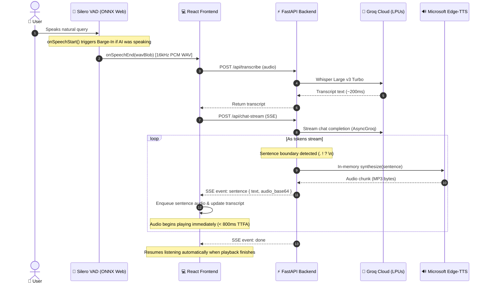

# Conversational Voice AI

> Lightning-fast, full-duplex conversational voice agent with **ChatGPT Advanced Voice Mode** aesthetics, neural **Silero VAD**, pipelined sentence streaming, and instant **barge-in interruption**.

[](https://python.org)
[](https://fastapi.tiangolo.com)
[](https://react.dev)
[](https://vitejs.dev)
[](https://groq.com)
[](https://github.com/snakers4/silero-vad)
[](https://github.com/rany2/edge-tts)

---

## ✨ Features

- 🧠 **Neural Silero VAD v5 (In-Browser)**: Runs client-side via WebAssembly & ONNX Runtime Web. Detects genuine human vocal cords, ignores background noise, and allows natural thinking pauses without premature truncation.
- ⚡ **Instant Conversational Barge-In**: User speech triggers instant interruption. The assistant immediately halts audio playback, aborts in-flight server generation, and returns to active listening.
- 🚀 **Pipelined Sentence Streaming (TTFA < 800ms)**: Tokens stream from Groq LPUs into an intelligent sentence boundary detector. Each sentence is synthesized in-memory with Edge-TTS and enqueued for sequential client playback, cutting perceived latency down to sub-second speeds.
- 🔮 **Single Action Button Voice Orb**: Luminous floating marble Voice Orb permanently positioned at lower center. Serves as the single action trigger to activate Live Voice Mode, with real-time audio reactivity (*Listening*, *Thinking*, *Speaking*, *Muted*).
- 🎙️ **Pure Speech-to-Speech Interface**:
  - Displays exclusively: `👤 Human Voice Instruction` and `🤖 Spoken AI Output` transcripts.
  - Bottom text bar completely removed.
  - Dedicated strike-through Microphone toggle (`mic-off`) stops listening instantly when clicked.
- 💾 **Persistent Conversation Storage**: Built-in SQLite database stores speech sessions and turns, accessible via the slide-out Sessions drawer.
- 💸 **100% Free Speech Stack**: Zero local GPU requirements. Powered by Groq's high-speed inference tier and Microsoft Edge's neural voice service.

---

## 🏗️ Architecture & Data Flow



---

## 📊 STS Stage Comparison

| Stage | Technology | Speed / Footprint | Key Advantage |
| :--- | :--- | :--- | :--- |
| **1. VAD & Turn-Taking** | **Silero VAD v5** (ONNX Web) | Client-side WASM (0 server load) | Eliminates false triggers; handles natural mid-sentence thinking pauses |
| **2. STT (Speech-to-Text)** | **Groq Whisper** (`large-v3-turbo`) | ~150–250ms cloud LPU inference | Production accuracy with near-zero local resource consumption |
| **3. LLM Reasoning** | **Groq** (`openai/gpt-oss-120b`) | 300+ tok/s (< 100ms TTFT) | Deep reasoning and conversational speed without enterprise VRAM |
| **4. TTS (Voice Output)** | **Microsoft Edge Neural TTS** | ~300–450ms per sentence | In-memory streaming, 100% free, natural neural voices (`GuyNeural`, `AriaNeural`) |

---

## 🚀 Getting Started

### Prerequisites
- **Python 3.10+**
- **Node.js 18+** & npm
- A free **Groq API Key** from [console.groq.com](https://console.groq.com)
- Working microphone and speakers / headphones

---

### Installation

1. **Clone the repository:**
   ```bash
   git clone https://github.com/username/voice-ai-prototype.git
   cd "Voice AI prototype"
   ```

2. **Configure environment variables:**
   Copy `.env.example` to `.env`:
   ```bash
   cp .env.example .env
   ```
   Open `.env` and insert your Groq API key:
   ```env
   GROQ_API_KEY=gsk_your_groq_api_key_here
   GROQ_LLM_MODEL=openai/gpt-oss-120b
   TTS_VOICE=en-US-GuyNeural
   BACKEND_PORT=8000
   ALLOWED_ORIGINS=http://localhost:5173
   ```

3. **Set up Python backend environment:**
   ```bash
   python -m venv venv
   # On Windows (PowerShell):
   venv\Scripts\Activate.ps1
   # On macOS/Linux:
   source venv/bin/activate

   pip install -r backend/requirements.txt
   ```

4. **Install React frontend dependencies:**
   ```bash
   cd frontend
   npm install
   cd ..
   ```

---

## 🏃 Running the Application

### Option A: Full-Stack Interactive Web App (Recommended)

Start the backend and frontend in separate terminals:

**Terminal 1 — FastAPI Backend:**
```bash
# In project root with venv activated:
python -m backend.main
```
*Backend runs on `http://localhost:8000` with hot reload.*

**Terminal 2 — React Frontend:**
```bash
cd frontend
npm run dev
```
*Frontend runs on `http://localhost:5173`.*

1. Open **`http://localhost:5173`** in your browser.
2. Click the central floating **Voice Orb** (the single action button) to turn on **Live Voice Mode**.
3. Allow microphone permissions.
4. Speak naturally—the assistant streams spoken responses in real time.
5. In the bottom dock, click the **Microphone** button to toggle mute:
   - Showing normal mic: active listening.
   - Showing strike-through (`mic-off`): completely pauses listening.
6. Click the top-right **Sessions** button to browse, reload, or delete stored voice conversations.

---

### Option B: Terminal CLI Prototype

For a standalone terminal-based push-to-talk experience:
```bash
# In project root with venv activated:
python voice_ai.py
```
- Press **Enter** once to start recording.
- Speak your message.
- Press **Enter** again to stop recording and hear the spoken response.

---

## 🔌 API Reference

| Method | Endpoint | Payload | Response | Description |
| :--- | :--- | :--- | :--- | :--- |
| `GET` | `/api/health` | None | `{"status": "ok"}` | Server health probe |
| `POST` | `/api/transcribe` | Multipart `audio` | `{"text": "..."}` | Groq Whisper STT |
| `POST` | `/api/chat` | JSON `{ message, history, conversation_id }` | `{"reply": "..."}` | Standard LLM response & persistence |
| `POST` | `/api/chat-stream` | JSON `{ message, history, conversation_id }` | `text/event-stream` | **SSE streaming**: yields sentence text + base64 MP3 chunks & auto-persists |
| `POST` | `/api/tts` | JSON `{ text, voice }` | `audio/mpeg` | Edge-TTS audio synthesis |
| `GET` | `/api/conversations` | None | `{"conversations": [...]}` | List saved voice conversations |
| `GET` | `/api/conversations/{id}` | None | `{"conversation": {...}}` | Get session details & messages |
| `POST` | `/api/conversations` | JSON `{ title }` | `{"id": "...", ...}` | Create new voice session |
| `DELETE` | `/api/conversations/{id}` | None | `{"success": true}` | Delete voice session |

---

## 🧪 Testing & Verification

- **Linting:**
  ```bash
  cd frontend && npm run lint
  ```
- **Frontend Production Build:**
  ```bash
  cd frontend && npm run build
  ```
- **Backend Syntax Check:**
  ```bash
  python -m py_compile backend/main.py backend/services/llm.py backend/services/tts.py
  ```

---

## ⚙️ Configuration Options

| Variable | Default | Description |
| :--- | :--- | :--- |
| `GROQ_API_KEY` | *required* | API key from console.groq.com |
| `GROQ_LLM_MODEL` | `openai/gpt-oss-120b` | Groq LLM model (`openai/gpt-oss-120b`, `llama-3.3-70b-versatile`, etc.) |
| `TTS_VOICE` | `en-US-GuyNeural` | Edge-TTS neural voice (`en-US-GuyNeural`, `en-US-AriaNeural`, `en-GB-SoniaNeural`) |
| `BACKEND_PORT` | `8000` | FastAPI server port |
| `ALLOWED_ORIGINS` | `http://localhost:5173` | Allowed CORS origins for the frontend |

---

## 📜 License

Distributed under the Apache 2.0 License.
