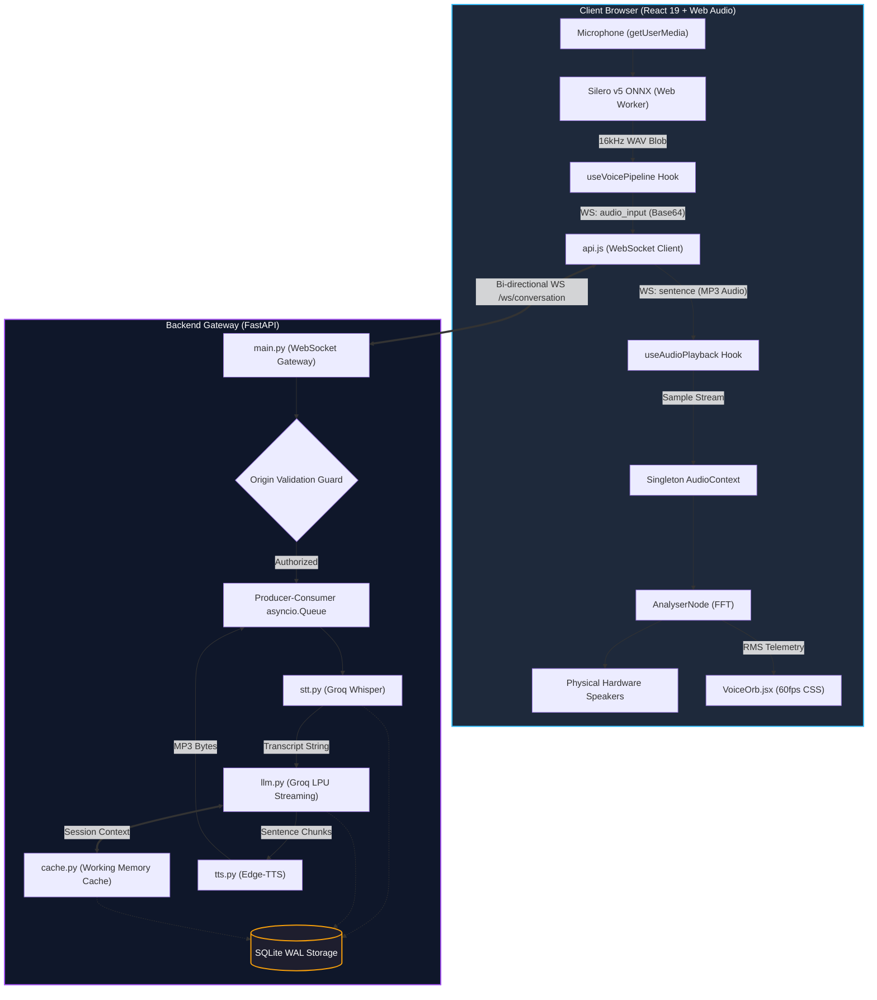
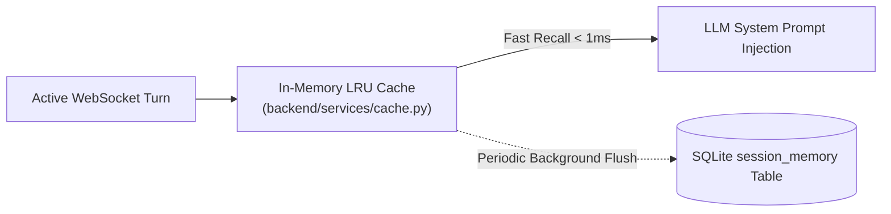

# 02. System Architecture & Schemas

**Project:** Conversational Voice AI Prototype  
**Layer:** End-to-End System Design, Network Protocols, and Schemas  
**Target Platform:** FastAPI (Python 3.10+) + React 19 (Vite) + SQLite  

---

## 1. High-Level System Architecture

The architecture decouples the browser client from heavy inference models through a high-concurrency asynchronous gateway. All data paths operate on **streaming byte buffers** to minimize Time-To-First-Audio (TTFA).



---

## 2. Directory Structure & Component Ownership

```text
Voice AI prototype/
├── backend/                        # FastAPI Application & Cloud Services
│   ├── main.py                     # WebSocket gateway, REST routes, CORS/CSWSH security
│   ├── config.py                   # Environment loader (Groq, Voices, Ports, Origins)
│   ├── schemas/                    # Pydantic v2 data models
│   │   ├── chat.py                 # Chat request/response validation
│   │   └── tts.py                  # TTS synthesis request models
│   ├── services/                   # Core business logic & pipeline stages
│   │   ├── stt.py                  # In-memory Groq Whisper transcription (BytesIO)
│   │   ├── llm.py                  # Streaming sentence chunker & sliding window context
│   │   ├── cache.py                # Working memory & session context cache (Phase 9)
│   │   ├── tts.py                  # Edge-TTS synthesizer with regional voice detection
│   │   └── storage.py              # SQLite WAL connection pool & conversation CRUD
│   └── tests/                      # Automated regression suite
│       └── test_pipeline.py        # Tokenizer, storage cascade, and audio unit tests
│
├── frontend/                       # React 19 Single Page Application (Vite)
│   ├── public/
│   │   └── wasm/                   # Static ONNX Runtime & Silero VAD binaries
│   ├── src/
│   │   ├── App.jsx                 # Top-level shell, session routing & hotkeys
│   │   ├── components/             # UI Components
│   │   │   ├── VoiceOrb.jsx        # 60fps RMS-reactive visualizer
│   │   │   ├── TopHeader.jsx       # Header, session status & quick controls
│   │   │   ├── MessageFeed.jsx     # Word-synchronized subtitle bubbles
│   │   │   └── SessionsSidebar.jsx # Historical conversation drawer
│   │   ├── hooks/                  # Audio Graph & State Machine Custom Hooks
│   │   │   ├── useVoicePipeline.js # Master conversational coordinator & echo shield
│   │   │   ├── useAudioPlayback.js # Singleton AudioContext & hardware clock sync
│   │   │   └── useVAD.js           # Silero ONNX Web Worker & RMS fallback driver
│   │   └── services/
│   │       └── api.js              # WebSocket connection & REST client
│   ├── vite.config.js              # Vite bundler, proxy configuration & COOP/COEP headers
│   └── package.json                # Dependencies (@ricky0123/vad-web, tailwindcss v4)
│
├── data/                           # Local persistent database directory
│   └── conversations.db            # SQLite database file (WAL mode)
├── docs/                           # Authoritative NotebookLM Knowledge Base
└── .env.example                    # Environment variable template
```

---

## 3. Database Schema (SQLite WAL DDL)

Database persistence is handled by a single file database at `data/conversations.db` configured with Write-Ahead Logging (`PRAGMA journal_mode = WAL;`) and referential cascade deletes (`PRAGMA foreign_keys = ON;`).

```sql
-- Conversations Table: Tracks active and historical voice dialogue sessions
CREATE TABLE IF NOT EXISTS conversations (
    id TEXT PRIMARY KEY,
    title TEXT NOT NULL DEFAULT 'New Conversation',
    created_at TIMESTAMP DEFAULT CURRENT_TIMESTAMP,
    updated_at TIMESTAMP DEFAULT CURRENT_TIMESTAMP
);

-- Messages Table: Stores chronological user queries and assistant responses
CREATE TABLE IF NOT EXISTS messages (
    id INTEGER PRIMARY KEY AUTOINCREMENT,
    conversation_id TEXT NOT NULL,
    role TEXT NOT NULL CHECK(role IN ('user', 'assistant', 'system')),
    content TEXT NOT NULL,
    created_at TIMESTAMP DEFAULT CURRENT_TIMESTAMP,
    FOREIGN KEY (conversation_id) REFERENCES conversations(id) ON DELETE CASCADE
);

-- Indices for rapid session retrieval
CREATE INDEX IF NOT EXISTS idx_messages_conversation_id ON messages(conversation_id);
CREATE INDEX IF NOT EXISTS idx_conversations_updated_at ON conversations(updated_at DESC);
```

---

## 4. WebSocket Message Protocol (`/ws/conversation`)

The full-duplex session communicates over a single WebSocket connection using typed JSON frames.

### Client-to-Server Messages

#### 1. Session Initialization (`init`)
Sent immediately upon connection to link the socket to an existing SQLite session.
```json
{
  "type": "init",
  "conversation_id": "c8a14b3d-2f9a-41f2-89e4-c5a6d7e8f9b0",
  "history": [
    { "role": "user", "content": "What is relativity?" },
    { "role": "assistant", "content": "Relativity explains how speed affects space and time." }
  ]
}
```

#### 2. Audio Payload (`audio_input`)
Emitted by client VAD when user speech terminates.
```json
{
  "type": "audio_input",
  "audio": "UklGRiQAAABXQVZFZm10IBAAAAABAAEARKwAAIhYAQACABAAZGF0YQAAAAA="
}
```

#### 3. Conversational Interruption (`interrupt`)
Emitted instantly when the client interrupts active assistant playback.
```json
{
  "type": "interrupt"
}
```

#### 4. Heartbeat Keepalive (`ping`)
Emitted every 20 seconds to prevent reverse proxy timeouts.
```json
{
  "type": "ping"
}
```

---

### Server-to-Client Messages

#### 1. Instant User Transcript (`transcript`)
Emitted within 200ms of audio upload to render the user's speech bubble immediately.
```json
{
  "type": "transcript",
  "role": "user",
  "text": "Explain quantum computing in simple terms."
}
```

#### 2. Streaming Sentence Chunk (`sentence`)
Emitted sequentially as each sentence finishes synthesis.
```json
{
  "type": "sentence",
  "index": 0,
  "text": "Quantum computing uses the principles of quantum physics.",
  "audio": "//OExAAAAANIASAAA..."
}
```

#### 3. Generation Complete (`done`)
Emitted when all sentences for the turn have finished streaming.
```json
{
  "type": "done",
  "count": 3,
  "elapsed": 1.42
}
```

#### 4. Interruption Acknowledged (`interrupted`)
Emitted when the server cleanly halts active generation tasks.
```json
{
  "type": "interrupted"
}
```

#### 5. Heartbeat Response (`pong`)
```json
{
  "type": "pong"
}
```

---

## 5. Security & Concurrency Architecture

### Cross-Site WebSocket Hijacking (CSWSH) Defense
Standard CORS headers do not protect WebSockets during the HTTP upgrade handshake. The server enforces strict validation:
```python
origin = websocket.headers.get("origin")
if origin:
    clean_origin = origin.rstrip("/")
    allowed = [o.rstrip("/") for o in ALLOWED_ORIGINS]
    if clean_origin not in allowed and "*" not in ALLOWED_ORIGINS:
        logger.warning("[WS SEC] Rejected unauthorized origin: %s", origin)
        await websocket.close(code=status.WS_1008_POLICY_VIOLATION)
        return
```

### Serialized Socket Writing via `asyncio.Queue`
In Starlette / FastAPI, `WebSocket.send_json()` is not re-entrant. Concurrent invocations (e.g. streaming sentence frames while responding to a keepalive ping) corrupt TCP frames. The server routes all downstream transmissions through an internal queue:
```python
send_queue: asyncio.Queue = asyncio.Queue()

async def socket_writer():
    while True:
        msg = await send_queue.get()
        if msg is None:
            break
        await websocket.send_json(msg)
        send_queue.task_done()
```

---

## 6. Working Memory Cache Architecture (Phase 9)

To allow the assistant to remember facts, user preferences, and specific phrasing from earlier in the conversation without token bloat, the architecture implements a **two-tier memory model**:



### Session Memory DDL
```sql
CREATE TABLE IF NOT EXISTS session_memory (
    conversation_id TEXT PRIMARY KEY,
    summary_context TEXT,
    key_entities TEXT, -- JSON array of extracted entity strings
    last_updated TIMESTAMP DEFAULT CURRENT_TIMESTAMP,
    FOREIGN KEY (conversation_id) REFERENCES conversations(id) ON DELETE CASCADE
);
```
